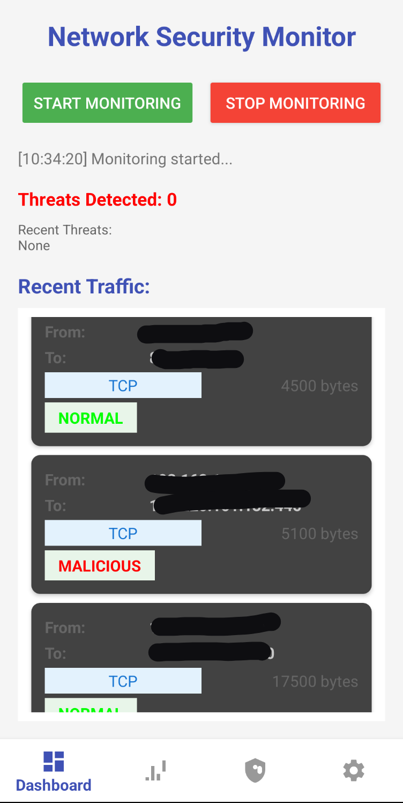
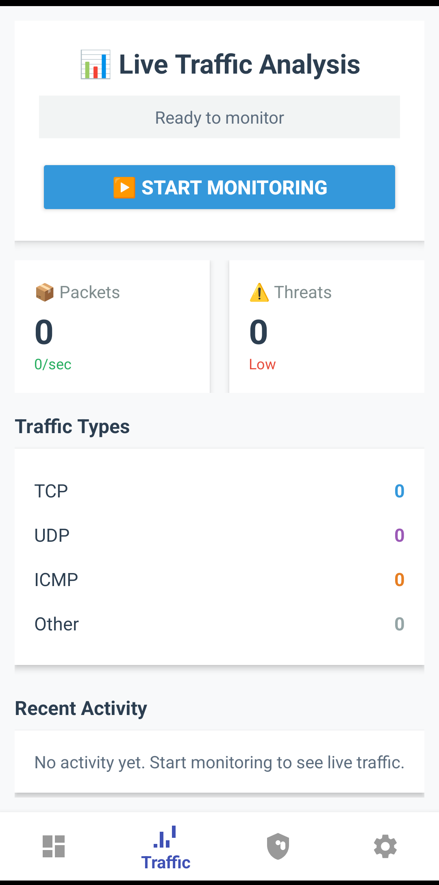
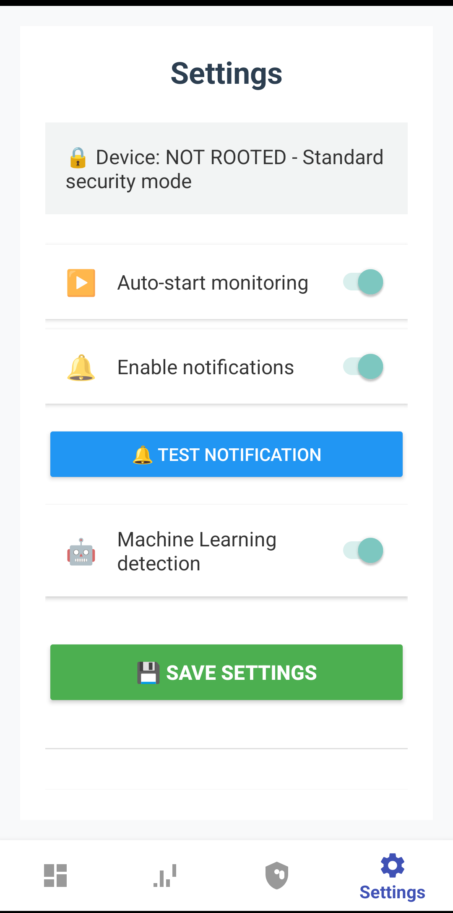

# 🔒 Network Security Monitor

[](https://github.com/Hannesjht/Android-Network-Monitor/releases/latest/download/NetworkSecurityMonitorv1.0.apk](https://github.com/Hannesjht/Network-Security-Monitor/tree/main/Android-Network-Monitor-GitHub/app/build/outputs/apk/release))


A professional Android application for real-time network security monitoring, threat detection, and traffic analysis.

## 📱 Screenshots

| Dashboard | Traffic Analysis | Security Logs | Settings |
|:---:|:---:|:---:|:---:|
|  |  |  |  |

|  |  |  |  |

**Latest Version:** v1.0  
**Minimum Android:** 8.0 (API 26)  
**File Size:** ~15 MB

## ⚡ Features

### 🔍 Network Monitoring
- Real-time packet analysis
- TCP/UDP/ICMP protocol detection
- Traffic rate monitoring
- Threat detection engine

### 🛡️ Security Features
- ML-based threat detection
- Security event logging
- Root status detection
- Local data processing (no cloud)

### 📊 Professional UI
- Material Design 3
- Dark/Light theme ready
- Card-based layout
- Real-time statistics
- Professional settings panel

### ⚙️ Technical Features
- MVVM Architecture
- Kotlin Coroutines
- SharedPreferences for settings
- Notification system
- GitHub integration

## 🏗️ Architecture

📁 Network Security Monitor
├── 📁 app/src/main
│ ├── 📁 java/com/security/monitor
│ │ ├── 📁 fragments # UI Fragments
│ │ ├── 📁 utils # Utilities
│ │ └── MainActivity.kt # Main entry
│ └── 📁 res
│ ├── 📁 layout # XML layouts
│ ├── 📁 drawable # Icons & images
│ └── 📁 values # Strings, colors
├── 📁 screenshots # App screenshots
└── README.md # This file


## 🛠️ Installation

### For Users:
1. Download the APK from [Releases](https://github.com/Hannesjht/Android-Network-Monitor/releases)
2. Enable "Install from Unknown Sources"
3. Install and launch the app
4. Grant necessary permissions

### For Developers:
```bash
# Clone the repository
git clone https://github.com/Hannesjht/Android-Network-Monitor.git

# Open in Android Studio
# Build and run


📋 Prerequisites

    Android Studio 2022.3.1 or higher

    Android SDK 33+

    Java 17 or Kotlin 1.9.0

🚧 Building from Source

    Clone the repository

    Open in Android Studio

    Sync Gradle dependencies

    Build → Make Project (Ctrl+F9)

    Run on emulator or device

📁 Project Structure
text

📦 Android-Network-Monitor
├── 📂 app
│   ├── 📂 src/main
│   │   ├── 📂 java/com/security/monitor
│   │   │   ├── 📂 fragments
│   │   │   │   ├── DashboardFragment.kt
│   │   │   │   ├── TrafficFragment.kt
│   │   │   │   ├── LogsFragment.kt
│   │   │   │   └── SettingsFragment.kt
│   │   │   ├── 📂 utils
│   │   │   │   └── NotificationHelper.kt
│   │   │   └── MainActivity.kt
│   │   └── 📂 res
│   │       ├── 📂 layout
│   │       ├── 📂 drawable
│   │       └── 📂 values
├── 📂 screenshots
├── 📂 docs
├── build.gradle
├── README.md
└── LICENSE

🧪 Testing

The app includes:

    Unit tests for core functionality

    UI tests for fragment navigation

    Notification system testing

    Settings persistence testing

Run tests with:
bash

./gradlew test
./gradlew connectedAndroidTest

📈 Roadmap

    Basic network monitoring

    Professional UI design

    Notification system

    Real packet capture

    Advanced threat detection

    Export logs feature

    Widget implementation

    Cloud backup option

🤝 Contributing

Contributions are welcome! Please follow these steps:

    Fork the repository

    Create a feature branch (git checkout -b feature/AmazingFeature)

    Commit your changes (git commit -m 'Add AmazingFeature')

    Push to the branch (git push origin feature/AmazingFeature)

    Open a Pull Request

📄 License

This project is licensed under the MIT License - see the LICENSE file for details.
👨‍💻 Developer

Hannes Vorster
🏢 Vorster Security Micro Systems
📧 Your email here
🔗 GitHub Profile
💼 Portfolio
🌟 Acknowledgments

    Icons by Material Design

    Color palette from Material 3

    Inspired by network security tools

    Built with Android Studio

<div align="center">

⭐ If you like this project, give it a star! ⭐

https://api.star-history.com/svg?repos=Hannesjht/Android-Network-Monitor&type=Date
</div> ```
2. Add Repository Topics

Go to your repo → Settings → Topics → Add:

    android

    kotlin

    network-security

    monitoring

    cybersecurity

    android-app

    security-tools
